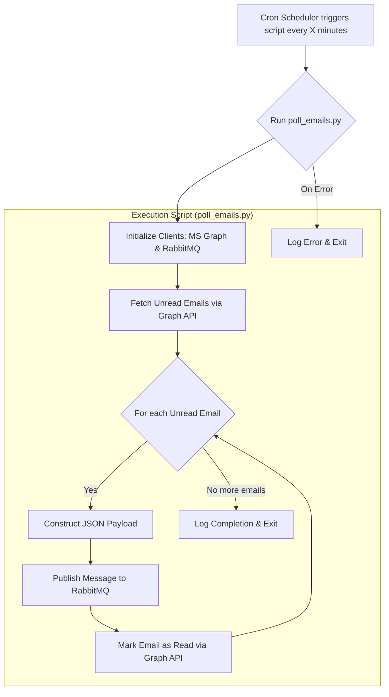

# 📧 Email Agent - Auto-Read, Summarizer & Attachment Extractor

> **A comprehensive email processing system that automatically reads emails, generates summaries, and extracts attachments for further processing.**

## ✨ Features

- 📬 **Automated Email Reading** - Monitors and reads incoming emails
- 📝 **AI-Powered Summarization** - Generates concise email summaries
- 📎 **Attachment Extraction** - Securely extracts and processes email attachments
- 🔄 **Real-time Processing** - Uses RabbitMQ for efficient message queuing
- 🌐 **Microsoft Graph Integration** - Seamless integration with Office 365

## 📁 Project Structure

```
📂 email_agent/
├── 🔧 .env.example
├── 📋 requirements.txt
├── 🐍 .venv/
├── 📧 email_polling_service/
│   ├── 🐍 __init__.py
│   ├── ⚙️ config.py
│   ├── 🌐 graph_client.py
│   ├── ▶️ main.py
│   ├── 🐰 rabbitmq_client.py
│   └── 🔧 service.py
├── 🗂️ email_parser/
│   ├── __init__.py
│   ├── parser.py
│   └── utils.py
├── 📝 summarizer/
│   ├── __init__.py
│   └── summarizer.py
├── 📎 attachment_handler/
│   ├── __init__.py
│   └── handler.py
├── 🏷️ document_identifier/
│   ├── __init__.py
│   └── identifier.py
├── 🔗 extraction_apis/
│   ├── __init__.py
│   ├── invoice_extractor.py
│   ├── po_extractor.py
│   └── ewaybill_extractor.py
├── 🖥️ ui_dashboard/
│   ├── package.json
│   ├── public/
│   └── src/
└── 🗃️ database/
   ├── models.py
   └── migrations/
```

## Flowchart



## 📋 File Descriptions

| File | Description |
|------|-------------|
| 🔧 **config.py** | Handles loading all configurations from environment variables |
| 🌐 **graph_client.py** | Contains refactored code to interact with MS Graph API |
| 🐰 **rabbitmq_client.py** | Utility to manage RabbitMQ connection and message publishing |
| 🔧 **service.py** | Core logic for the email polling service |
| ▶️ **main.py** | Entry point to start the service |

## 🚀 Getting Started

### Prerequisites

- Python 3.8+
- Microsoft Azure account with Graph API access
- RabbitMQ server

### Installation

1. **Clone the repository**

   ```bash
   git clone <repository-url>
   cd email_agent
   ```

2. **Create virtual environment**

   ```bash
   python -m venv .venv
   source .venv/bin/activate  # On Windows: .venv\Scripts\activate
   ```

3. **Install dependencies**

   ```bash
   pip install -r requirements.txt
   ```

4. **Configure environment variables**

   ```bash
   cp .env.example .env
   # Edit .env with your configuration
   ```

5. **Run the service**

   ```bash
   python email_polling_service/main.py
   ```

## ⚙️ Configuration

Set up the following environment variables in your `.env` file:

```env
# Microsoft Graph API
AZURE_TENANT_ID=your_tenant_id
AZURE_CLIENT_ID=your_client_id
AZURE_CLIENT_SECRET=your_client_secret

# RabbitMQ
RABBITMQ_HOST=localhost
RABBITMQ_PORT=5672
RABBITMQ_USERNAME=guest
RABBITMQ_PASSWORD=guest

# Email Configuration
MAILBOX_ADDRESS=your_email@domain.com
```

## System Architecture and Design (Revised)

This document details the architecture for an AI agent that processes emails from a designated inbox, identifies document types, and then presents them to a user for confirmation before final data extraction.

### Component Breakdown (Revised)

This revised flow places the automated document identification before the user interaction step.

#### 📨 Email Polling Service

- Continuously monitors the `hello@cargoa.io` inbox for new emails.
- Can use webhooks (real-time) or scheduled polling.

#### 🗂️ Email Parser

- Extracts key information from new emails:
  - Sender
  - Subject
  - Body
  - Attachments

#### 📝 Email Summarizer

- Passes the email body to a large language model (LLM).
- Generates a concise summary for user context on the UI dashboard.

#### 📎 Attachment Handler

- Securely transfers attachments to cloud storage (e.g., AWS S3, Google Cloud Storage).
- Ensures original files are saved before processing.

#### 🏷️ Document Identifier

- Analyzes stored attachments using a machine learning model.
- Automatically identifies document type (e.g., Invoice, Purchase Order, E-way Bill).

#### 🖥️ UI Dashboard

- Main interface for human-in-the-loop.
- Displays:
  - Email summary
  - List of attachments
  - Predicted document type for each attachment

#### 👤 Human Confirmation

- User reviews dashboard information.
- Confirms or overrides predicted document type.
- Confirmation triggers the next processing stage.

#### 🔗 Extraction APIs

- Upon confirmation, dispatches documents to specific extraction APIs:
  - 🧾 Invoice Extraction API
  - 📄 Purchase Order Extraction API
  - 🚚 E-way Bill Extraction API

#### 🗃️ Processed Data

- Final structured data is stored in a database or sent to downstream systems.

## Development and Deployment Strategy

The technology stack and deployment strategy remain robust and suitable for this workflow.

### 🛠️ Technology Stack

- **Backend:** Python (TensorFlow, PyTorch, Scikit-learn, Flask, Django)
- **Frontend:** React or Vue.js for the interactive UI dashboard
- **AI/ML Models:**
  - Email Summarization: Pre-trained LLMs (OpenAI GPT, Google Gemini, Hugging Face)
  - Document Identification: Custom models (TensorFlow, PyTorch) or cloud AI services (Google Cloud Vision AI, AWS Rekognition)
- **Storage:** Cloud object storage (AWS S3, Google Cloud Storage, Azure Blob Storage)

### ⚙️ Deployment

- **Containerization:** Docker for packaging microservices
- **Orchestration:** Kubernetes (Amazon EKS, Google GKE, Azure AKS)
- **CI/CD:** GitHub Actions, Jenkins, or GitLab CI
- **Monitoring:** Prometheus (metrics), Grafana (visualization), ELK Stack (logging)

## POSTGRESQL

### Creating Tables

```bash
sudo -u postgres psql 
CREATE ROLE cargoa_user WITH LOGIN PASSWORD 'mysecretpassword';
CREATE DATABASE email_agent WITH OWNER = cargoa_user;
```

### Deleting the Tables in Postgresql

```bash
sudo -u postgres psql -c "DROP DATABASE email_agent;"
```

or

```bash
sudo -u postgres psql
DROP DATABASE email_agent;
\q
```

## 🤝 Contributing

1. Fork the repository
2. Create your feature branch (`git checkout -b feature/AmazingFeature`)
3. Commit your changes (`git commit -m 'Add some AmazingFeature'`)
4. Push to the branch (`git push origin feature/AmazingFeature`)
5. Open a Pull Request

## 📄 License

This project is licensed under the MIT License - see the [LICENSE](LICENSE) file for details.

---

> Made with ❤️ for efficient email processing
