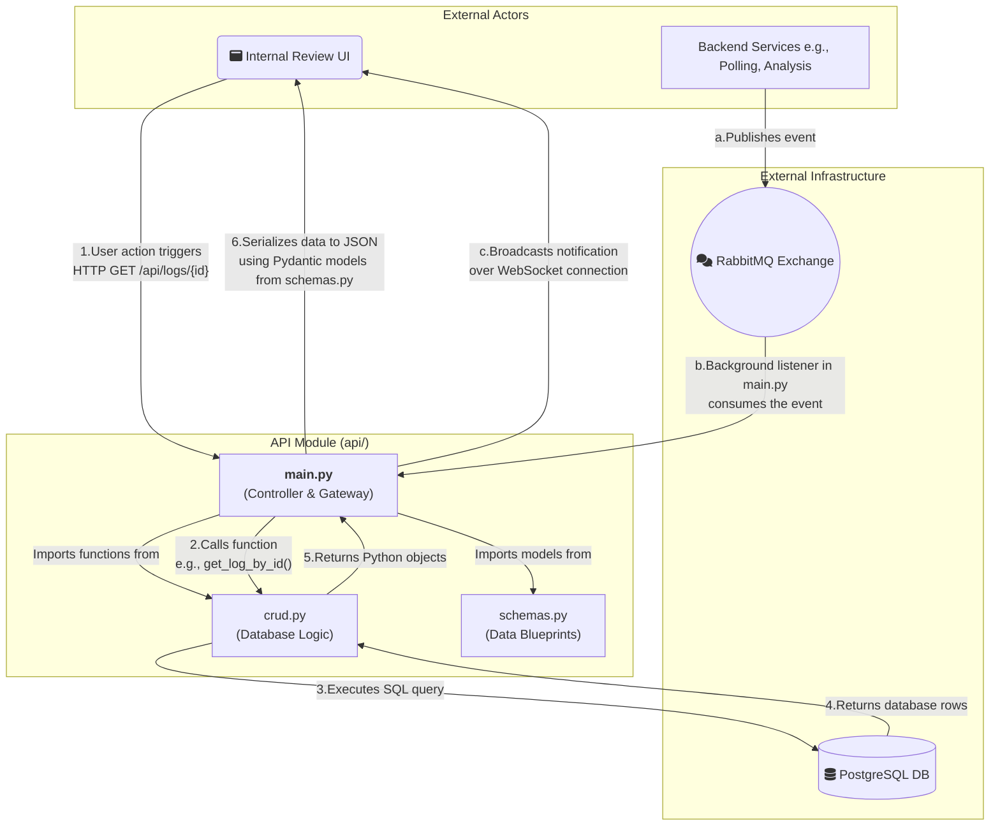

```mermaid
    graph TD
        subgraph "External Actors"
            UI(fa:fa-window-maximize Internal Review UI)
            Services[Backend Services e.g., Polling, Analysis]
        end

        subgraph "External Infrastructure"
            DB[(fa:fa-database PostgreSQL DB)]
            RMQ((fa:fa-comments RabbitMQ Exchange))
        end

        subgraph "API Module (api/)"
            direction LR
            Main["<b>main.py</b><br>(Controller & Gateway)"]
            CRUD["crud.py<br>(Database Logic)"]
            Schemas["schemas.py<br>(Data Blueprints)"]

            %% Internal Dependencies
            Main -- "Imports functions from" --> CRUD
            Main -- "Imports models from" --> Schemas
        end


        %% --- Flow 1: Data Pull via REST API ---
        UI -- "1.User action triggers<br>HTTP GET /api/logs/{id}" --> Main
        Main -- "2.Calls function<br>e.g., get_log_by_id()" --> CRUD
        CRUD -- "3.Executes SQL query" --> DB
        DB -- "4.Returns database rows" --> CRUD
        CRUD -- "5.Returns Python objects" --> Main
        Main -- "6.Serializes data to JSON<br>using Pydantic models from schemas.py" --> UI


        %% --- Flow 2: Real-time Push via WebSocket ---
        Services -- "a.Publishes event" --> RMQ
        RMQ -- "b.Background listener in main.py<br>consumes the event" --> Main
        Main -- "c.Broadcasts notification<br>over WebSocket connection" --> UI


```
